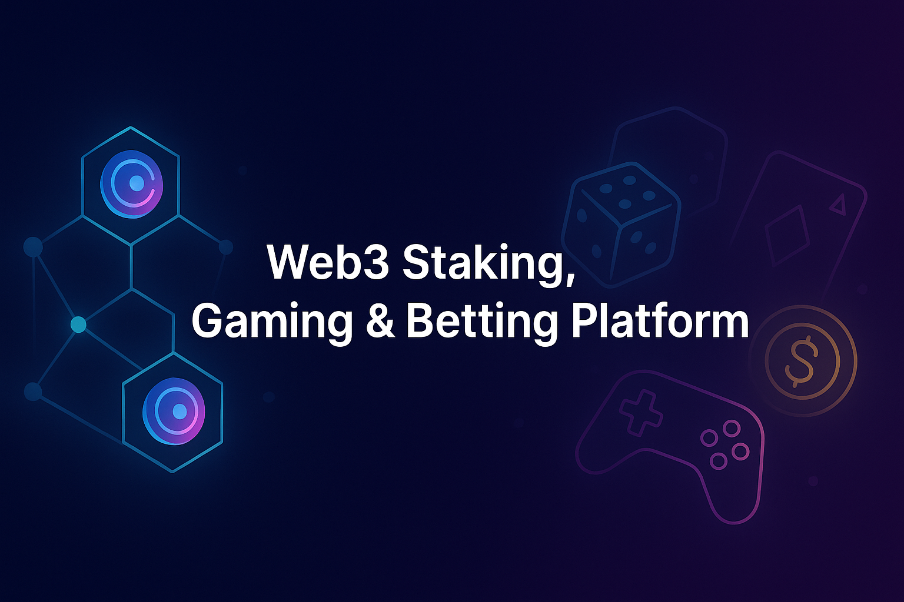
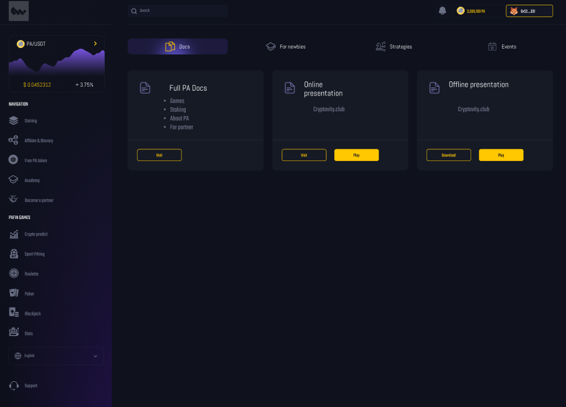
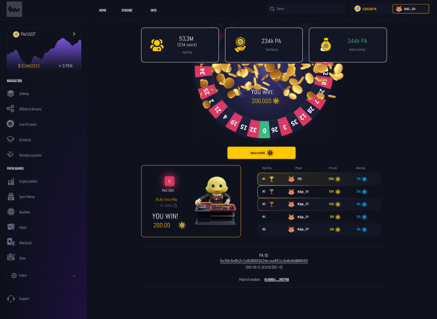

 

## Project Overview
This is a **multi-utility Web3 platform** that integrates staking, casino-style gaming, sports betting, and education into a single blockchain-powered ecosystem.

### Core Features
>✅ **Staking:** Lock PA tokens (and other supported assets) to earn rewards while funding the platform's gaming economy.        
>✅ **Gaming:** Casino-style games like roulette, slots, and prize wheels keep players engaged with quick, excitinh gameplay     
>✅ **Sports Betting:** Covers live and upcoming events, offering competitive odds and multiple bet types.                       
>✅ **Academy:** An interative learning hub teaching Crypto basics, platform mechanics, and risk management to onboard newcomers.

The goal is to create an **all-in-one hub** where players can **play, earn, and learn** without hopping between multiple platforms.

---

## Demo Version
The demo highlights:
>✅ **Staking Dashboard** – Simulated staking with reward tracking.               
>✅ **Mini Games Preview** – Early builds of roulette, slots, and spin-the-wheel.  
>✅ **Sports Betting UI** – Mock-up with odds feeds and betting slip preview.     
>✅ **Academy Hub** – Interactive tutorials and gamified quizzes.                 

**Note:** This demo uses **testnet contracts** and mock data for demonstration. It is **not connected to mainnet or real funds**.

---

## Screenshots & UI Preview

### Staking Dashboard
  
*Lock ChormaWay tokens and monitor rewards in real-time.*

### Game Lobby
  
*Casino-style game previews including roulette, slots, and prize wheel.*

---

## Tech Stack
>✅ **Frontend** – React / Next.js / TailwindCSS              
>✅ **Blockchain** – Solidity / Hardhat / Ethers.js           
>✅ **Backend** – Node.js / TypeScript / PostgreSQL / Redis   
>✅ **Games** – Phaser.js / Unity / WebGL                     
>✅ **Sports Data** – Integrated via 3rd-party APIs           
>✅ **Enterprise Layer** – ChormaWay BCDB middleware          

